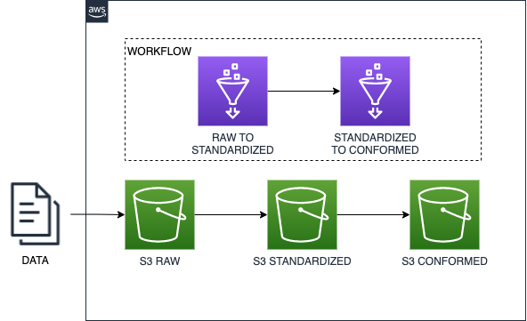
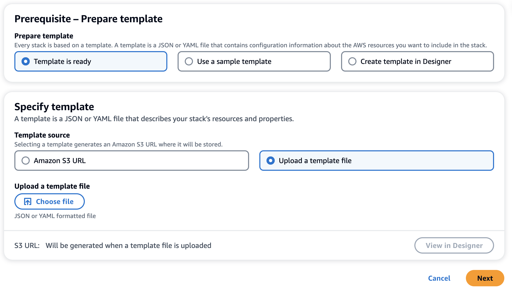
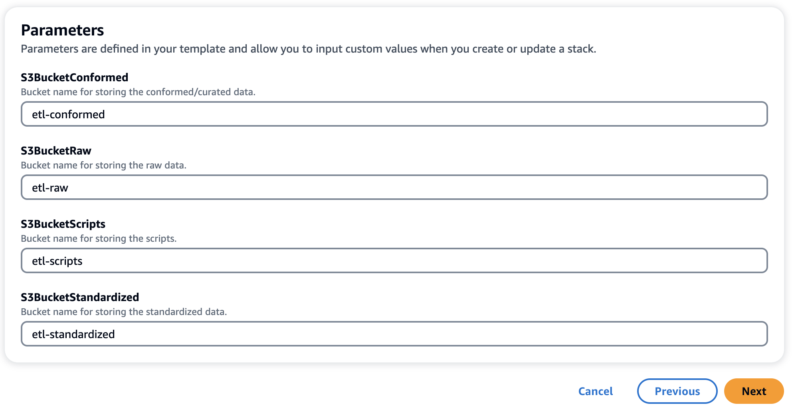
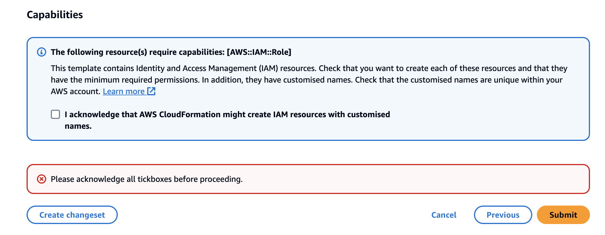
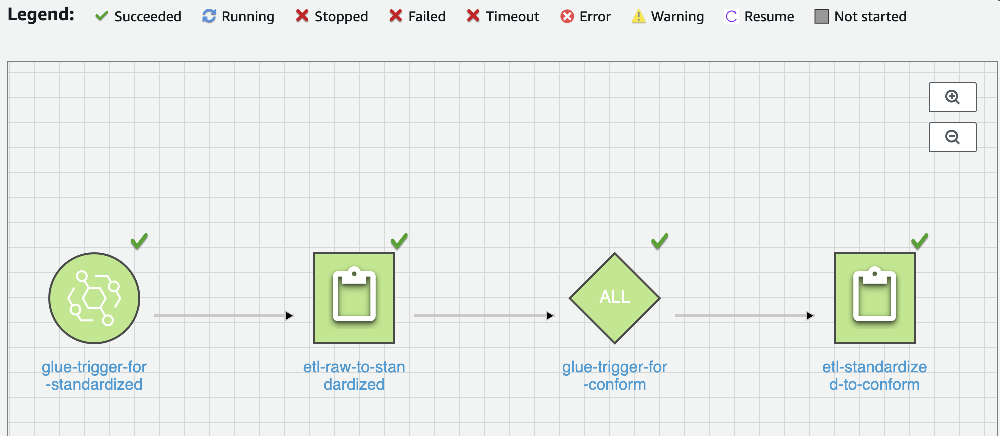

# Serverless ETL pipeline creation

This Cloudformation template deploys a sample ETL pipeline. It deploys the following components as part of the teamplate:

1. **S3 Buckets** : It creates a layered storage for stroring data in various stage which are raw, standardized and conformed
2. **Glue Jobs** : It creates two Glue job. Job etl-raw-to-standardized peforms transformations to standardize and move the data to standard storage layer. Job etl-standardized-to-conform peforms transfromation to make the data ready for consumers and move to conform storage layer.
3. **Workflow** : It creates a Workflow to orchestrate the ETL pipeline. The etl-raw-to-standardized job gets triggered whenever a new files arrives in raw storage layer. Once the etl-raw-to-standardized is successfull, it triggers the etl-standardized-to-conform job.




**Important**: 
1. This templates deploys various AWS services and there are costs associated with these services. Please refer the [AWS Pricing page](https://aws.amazon.com/pricing/) for details regarding pricing. You are responsible for any AWS costs incurred. No warranty is implied in this example.
2. The scripts used in transformation are only for the purpose of demo. You are responsible to create scripts for you own transformation requirements.
3. This makes use of **Yellow Taxi Trip Records** available at [NYC Taxi & Limousine Commission](https://www.nyc.gov/site/tlc/about/tlc-trip-record-data.page). Please review any license terms applicable to the dataset with your legal team and confirm that your use case complies with the terms before proceeding.

## Pre-requisites

* You should already have an AWS Acccount.The IAM user that you will use for deploying the this template must have sufficient permissions to make necessary AWS service calls and manage AWS resources.If you dont not an AWS account please [Create an AWS account](https://portal.aws.amazon.com/gp/aws/developer/registration/index.html) 
* You should have Git installed on your machine. [Git Installion](https://git-scm.com/book/en/v2/Getting-Started-Installing-Git)


## Instructions

1. Create a new directory and clone the GitHub repository:
    ``` 
    git clone https://github.com/aws-samples/serverless-etl-pipeline.git
    ```
2. Create an S3 bucket and upload both the scripts etl-raw-to-standardized.py and etl-standardized-to-conform.py from the scripts folder from cloned source code.

3. Navigate to [CloudFormation console](https://console.aws.amazon.com/cloudformationt/home) and click on **Create Stack** and select **With new resources (standard)**.

4. Select **Template is ready** and then **Upload a template file** and upload **serverless-etl-cfn.yaml** and click **Next**




5. Provide appropriate **Stack Name** and S3 bucket names in **Parameters** section. Please provide appropriate bucket names as there are Global in nature and common bucket names might already be taken. For S3BucketScripts, provide the bucket name used in step 2. Example if you have uploaded the scripts in location S3://bucket-name/scripts, then provide **bucket-name/scripts**



6. Click on **Next** and then no changes in next page and again click **Next**

7. Select and checkbox **I acknowledge that AWS CloudFormation might create IAM resources with customised names.** in the bottom section and the click on **Submit**



8. Wait for the resources to get deployed.


## Testing

1. Download the sample [NYC taxi data](https://d37ci6vzurychx.cloudfront.net/trip-data/yellow_tripdata_2023-01.parquet)

2. Navigate to the the S3 bucket for raw storage layer and upload this sample data file.

3. Once the file upload is complete, navigate to Worflow in Glue console.

4. The worflow will get triggered. Wait the worflow to complete, this will take couple of minutes.



5. Once the worflow is successfull, verify the data in standardized and conformed storage buckets.

----

## Security

See [CONTRIBUTING](CONTRIBUTING.md#security-issue-notifications) for more information.

## License

This library is licensed under the MIT-0 License. See the LICENSE file.
